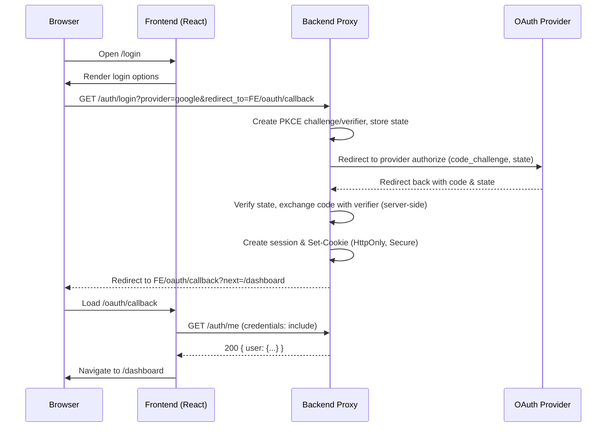

# Backend Proxy Contract for Secure Supabase Integration

## Overview
This document defines the backend proxy contract that enables the OceanLMS frontend to authenticate users and access data without exposing a Supabase anon key in the browser. The frontend relies on HTTP-only, same-site cookies managed by the backend, and never initializes a Supabase client on the client-side. All authentication and data access occur through backend endpoints.

## Goals
- Prevent exposure of Supabase anon/service keys to the browser.
- Use cookie-based sessions with HTTP-only cookies for security.
- Support OAuth/OIDC providers using PKCE with a secure server-side flow.
- Provide simple, REST-like proxy endpoints for LMS data (courses, assignments, grades).
- Document CORS, CSRF, and session cookie requirements that enable the React SPA to work in multiple environments.

## Environment and Configuration
The frontend references these environment variables:
- REACT_APP_BACKEND_URL: Base URL for backend proxy (e.g., https://api.oceanlms.example.com)
- REACT_APP_FRONTEND_URL: Deployed frontend URL (e.g., https://app.oceanlms.example.com)

Additional frontend variables used by the container may include:
- REACT_APP_API_BASE, REACT_APP_WS_URL, REACT_APP_NODE_ENV, REACT_APP_NEXT_TELEMETRY_DISABLED, REACT_APP_ENABLE_SOURCE_MAPS, REACT_APP_PORT, REACT_APP_TRUST_PROXY, REACT_APP_LOG_LEVEL, REACT_APP_HEALTHCHECK_PATH, REACT_APP_FEATURE_FLAGS, REACT_APP_EXPERIMENTS_ENABLED

The backend must:
- Expose the endpoints defined here at the base path indicated by REACT_APP_BACKEND_URL.
- Set secure cookies with appropriate attributes (Secure, HttpOnly, SameSite).
- Configure CORS to allow cross-site cookie usage from the frontend origin.

## Session Model
The session is cookie-based:
- The backend issues an HTTP-only, Secure cookie (e.g., session) after successful login or OAuth callback.
- Cookies should have SameSite=Lax by default. If your frontend and backend are on different top-level domains and require cross-site cookies, use SameSite=None; Secure (must be HTTPS).
- The cookie should carry either:
  - An encrypted session token that maps to a server-side session store containing Supabase access info, or
  - A signed token that the backend can use to retrieve the current user and act as a proxy to Supabase.
- The browser never sees Supabase keys or access tokens; it only stores the HTTP-only session cookie.

## CORS Requirements
The backend must configure CORS to support credentialed requests from the frontend origin:
- Access-Control-Allow-Origin: exactly REACT_APP_FRONTEND_URL (do not use *)
- Access-Control-Allow-Credentials: true
- Access-Control-Allow-Methods: GET, POST, PUT, PATCH, DELETE, OPTIONS
- Access-Control-Allow-Headers: Content-Type, Authorization, X-Requested-With
- Preflight (OPTIONS) responses should reflect the above headers and appropriate caching (e.g., Access-Control-Max-Age: 600)

Client behavior:
- The frontend uses fetch with credentials: include for all API calls.
- The backend must respond with Set-Cookie on the same domain defined by its hostname and appropriate cookie attributes.

## PKCE OAuth Flow
When using OAuth/OIDC providers (e.g., Google) with Supabase via the backend:
1. The frontend redirects the browser to GET /auth/login?provider=google&redirect_to=<FRONTEND_URL>/oauth/callback.
2. The backend generates a PKCE verifier and challenge on the server, stores state/verifier in a secure, temporary store (e.g., encrypted cookie or server cache), and starts the provider auth by redirecting to the provider authorization URL with code_challenge and state.
3. The provider redirects to the backend callback endpoint (not exposed to the browser) or to the frontend callback and then to the backend with the authorization code. Prefer a backend callback endpoint to exchange code server-side.
4. The backend performs the code exchange using the PKCE verifier and obtains provider tokens / Supabase session (server-side), then sets the HTTP-only session cookie for the browser and redirects the browser to REACT_APP_FRONTEND_URL/oauth/callback?next=<...>.
5. The frontend calls GET /auth/me to resolve the user and proceeds to the app.

Important notes:
- Never put the PKCE verifier in the browser. Store and use it only on the backend.
- Use short-lived, single-use state to prevent CSRF and replay attacks.

## Authentication Endpoints

### GET /auth/login
Initiates user login via email or OAuth provider.

Query parameters:
- provider: string, required. Example values: email, google
- redirect_to: string, required. Absolute URL to send the user back to after authentication. Typically `${REACT_APP_FRONTEND_URL}/oauth/callback`

Behavior:
- For provider=email, the backend may initiate a magic link or email OTP flow via Supabase on the server, then redirect appropriately after completion.
- For OAuth providers, backend starts the PKCE flow (see above).
- Responds with an HTTP redirect to the provider consent page or directly to redirect_to depending on the flow.

Example:
GET /auth/login?provider=google&redirect_to=https://app.example.com/oauth/callback

### GET /auth/callback
Completes the authentication flow.

Query parameters:
- code: string, optional. Provider/Supabase authorization code (if the provider redirects to frontend and then to backend).
- state: string, required when using OAuth-based flows.
- next: string, optional. Relative path in the app to continue to after sign-in (e.g., /dashboard).

Behavior:
- Backends that receive direct provider callbacks should perform the code exchange server-side. If the provider callback hits the frontend, the frontend should immediately redirect to this backend endpoint to complete the exchange.
- On success, sets the HTTP-only session cookie and redirects the browser to `${REACT_APP_FRONTEND_URL}/oauth/callback?next=<next || '/dashboard'>`.
- On failure, redirects to `${REACT_APP_FRONTEND_URL}/login?error=auth_failed`.

Response:
- 302 redirect with Set-Cookie on success.

### GET /auth/me
Returns the current authenticated user.

Request:
- Must include credentials (cookies). CORS must allow credentials.

Response:
- 200 application/json
  { "user": { "id": "uuid", "email": "user@example.com", "name": "User Name", "role": "student" } }
- 401 when no valid session cookie is present.

Frontend references:
- src/apiClient.js authApi.me()
- src/context/AuthContext.js initialization and refresh

### POST /auth/logout
Logs out the user by clearing the session cookie.

Behavior:
- Invalidates server session and clears HTTP-only cookie.
- Returns 204 No Content (or 200) on success.

Frontend references:
- src/apiClient.js authApi.logout()
- src/components/TopNav.js logout button
- src/context/AuthContext.js logout()

## Example Data Proxy Endpoints
The backend should expose REST-like endpoints for LMS data. These endpoints should:
- Validate the session via the HTTP-only cookie.
- Use server-side Supabase client (with service or anon key, securely stored) to query or mutate data.
- Enforce row-level security/authorization on the server; do not rely on the browser.

Examples:

### GET /api/courses
List courses available to the current user.
- Query params: optional pagination/filtering (e.g., page, pageSize, search).
- Response 200:
  [
    { "id": "course_1", "title": "Algebra I", "description": "Intro to Algebra" },
    { "id": "course_2", "title": "Biology", "description": "Foundations of Biology" }
  ]
- 401 if not authenticated.

### GET /api/courses/:id
Get details for a specific course, including modules/sections the user can access.
- Response 200:
  {
    "id": "course_1",
    "title": "Algebra I",
    "description": "Intro to Algebra",
    "instructor": "Jane Doe",
    "modules": [{ "id": "m1", "title": "Linear Equations", "summary": "Basics" }]
  }
- 404 if not found or not authorized.
- 401 if not authenticated.

### GET /api/assignments
List assignments for the current user.
- Response 200:
  [
    { "id": "a1", "title": "Homework 1", "courseTitle": "Algebra I", "dueDate": "2025-01-20T00:00:00Z" }
  ]

### GET /api/grades
List grades/performance for the current user.
- Response 200:
  [
    { "id": "g1", "courseTitle": "Biology", "overall": "A-", "updatedAt": "2025-01-15T12:01:00Z" }
  ]

### GET /api/dashboard/summary
Provide dashboard summary stats:
- Response 200:
  {
    "activeCourses": 3,
    "assignmentsDue": 2,
    "avgGrade": "B+"
  }

Notes:
- These example shapes align with current frontend expectations in:
  - src/pages/CoursesPage.js -> GET /courses (may be proxied internally to /api/courses)
  - src/pages/CourseDetailPage.js -> GET /courses/:id
  - src/pages/AssignmentsPage.js -> GET /assignments
  - src/pages/GradesPage.js -> GET /grades
  - src/pages/DashboardPage.js -> GET /dashboard/summary
- The backend can implement these as /api/... and map to the paths the frontend calls or adjust the frontend routes to /api/...; consistency is required.

## Security Considerations
- Never expose Supabase anon or service keys in client code or in responses.
- Use HTTPS for all traffic; set Secure on cookies.
- Implement RLS (row-level security) on Supabase; backend should enforce authorization scoping on all queries.
- Validate and sanitize all user inputs, including query parameters.
- Implement rate limiting and account lockout policies as appropriate.
- Avoid logging PII or sensitive tokens. Ensure logs exclude cookie contents and provider tokens.
- Implement CSRF protection for state-changing endpoints (e.g., POST /auth/logout), such as SameSite cookies combined with CSRF tokens, or double-submit cookie strategy. Since this SPA uses credentialed fetch, consider including an X-CSRF-Token header and validating it server-side.

## Frontend Contract Summary
- All API calls use fetch with credentials: include (see src/apiClient.js).
- On HTTP 401, the client redirects to /login with a next parameter.
- Login triggers browser redirect to backend GET /auth/login with redirect_to pointing at ${REACT_APP_FRONTEND_URL}/oauth/callback.
- After successful auth, backend sets cookie and redirects to frontend /oauth/callback, which calls GET /auth/me and then routes to the intended page.

## Sequence Diagram

## Error Handling
- Invalid session cookie: return 401 with no sensitive details.
- PKCE state mismatch or expired: redirect to /login with error code.
- Provider code exchange failure: log internally; redirect with user-friendly error.
- Data proxy authorization failures: 403 when authenticated but not permitted.

## Versioning and Changes
- Backward compatible changes (adding new fields in JSON) are allowed.
- Breaking changes to endpoint paths or required fields should be versioned under a prefix (e.g., /v2/).
- The frontend currently expects the routes and shapes described above; update both sides coherently if changes are needed.

## References to Current Code
- educational-content-management-system-263732-263747/lms_frontend/src/apiClient.js
- educational-content-management-system-263732-263747/lms_frontend/src/context/AuthContext.js
- educational-content-management-system-263732-263747/lms_frontend/src/pages/OAuthCallbackPage.js
- educational-content-management-system-263732-263747/lms_frontend/src/pages/CoursesPage.js
- educational-content-management-system-263732-263747/lms_frontend/src/pages/CourseDetailPage.js
- educational-content-management-system-263732-263747/lms_frontend/src/pages/AssignmentsPage.js
- educational-content-management-system-263732-263747/lms_frontend/src/pages/GradesPage.js
- educational-content-management-system-263732-263747/lms_frontend/src/pages/DashboardPage.js
